# RDP-SIEM

## Project overview
This project sets up Azure Sentinel (Microsoft's cloud-native Security Information and Event Management system) to monitor real-world cyber attacks by creating an exposed honeypot VM (a decoy virtual machine designed to attract attackers). The focus is on ingesting Windows security logs for failed RDP (Remote Desktop Protocol) logins (Event ID 4625 - audit failures indicating bad username/password attempts), enriching them with geographic data and visualizing attacks on a world map.

<!-- 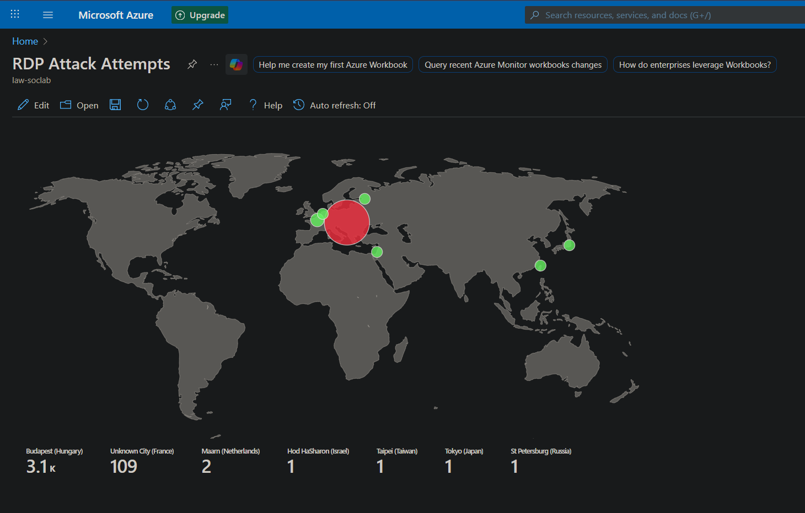 -->
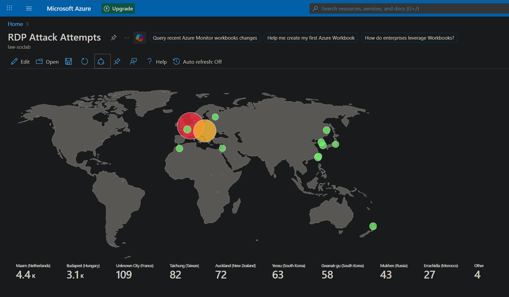

* **Why it matters:** Exposing a VM to the internet quickly attracts brute-force attacks from bots worldwide, providing live data to practice log ingestion, transformation, and visualization—core SIEM functions—without needing a corporate environment.    
* **High-level workflow:** Create Azure resources → Deploy exposed VM → Run PowerShell script for geo-enrichment → Ingest custom logs → Extract fields → Visualize in Sentinel workbook. Practice multiple times to expand or optimize.    
* **Prerequisites:** Free Azure account (requires credit card; $200 credit for 30 days, lab uses little). Delete resource group at end to avoid costs.    

> **⚠️ Warning:** This honeypot exposes RDP (port 3389) and all traffic publicly—**never do this in production**. It's solely for lab discovery by attackers via scans/pings.    


## Azure Resource Setup:
In Azure Portal, search for and create the following resources:

- **Resource Groups** act as logical folders organizing related Azure resources like VMs and networks. Create one and chose a region (e.g., `rg-soclab` in East US 2 region).
- **Virtual Network (VNet)** network where VMs "plug in" for connectivity; create and name one in same the Resource Group/region used before (e.g., `vnet-soclab` in East US 2 region). Accept default config for subnet/address space.  
- **Virtual Machines** These is where we will create our honeypot VM. Config per tab:
- Basics: Resource Group (`rg-soclab`), name (any, e.g., `corpnet-east1`), image (Windows 10 version 22H2 x64 Gen2), size (Standard_Ds2_v3). Set Admin username/password (e.g., `labuser`/`cyberlab123!`— remember or reset later) and confirm licensing checkbox.
- Disk: Standard HDD for cost savings. 
- Networking: Select previously created VNet/subnet, enable public IP auto-delete.   
- Monitoring: Disable boot diagnostics; review/create—takes minutes.

- **Post-deployment:** Resource Group shows VM, public IP, **Network Interface** (virtual Ethernet port), **Network Security Group (NSG)** (cloud firewall), disk.  
- **Significance:** Public IP exposes VM to internet; attacks start in minutes/hours.  
- **Cost warning:** Larger sizes/disks cost more (~$70/month if left on); delete when done.  

| Component | Purpose | Example Name |
|-----------|---------|--------------|
| **Resource Group** | Organizes resources | rg-soclab    |
| **Virtual Network** | Connects VM | vnet-soclab    |
| **Virtual Machine** | Honeypot target | corpnet-east1    |
| **Network Security Group** | Cloud firewall | Auto-created    |
| **Public IP** | Internet exposure | Auto-assigned    |

   

## Exposing the VM: Opening Network Security Group and Windows Firewall

To entice attackers, fully open inbound traffic (normally insecure).  

- NSG mechanism: Edit inbound rules—delete RDP default (allows port 3389 from any), add "DANGER_Allow_All" rule: Source/Destination/Any port/protocol All, priority 100 (lower = evaluated first). 

- RDP (**Remote Desktop Protocol**, port 3389) initially only open; new rule allows *all* traffic.
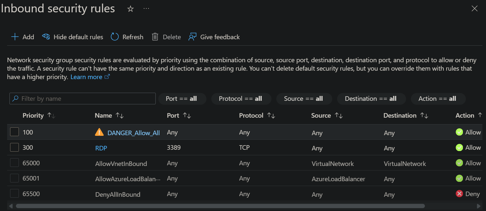

- RDP to VM: Copy public IP, use Windows Remote Desktop (`mstsc`) or Mac "Windows App"; username/password from creation.

- Inside VM: Search `wf.msc` (**Windows Defender Firewall**), disable all profiles (Domain/Private/Public) via tabs/properties.
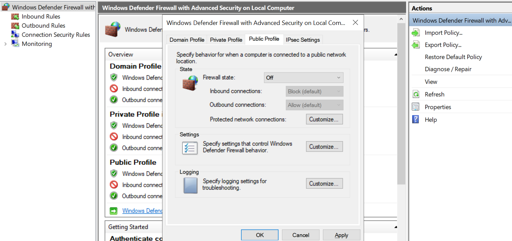

- Verify exposure: Local ping public IP (success = reachable by attackers). 
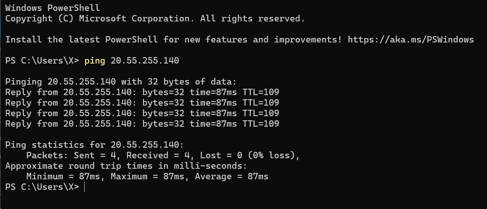 

> **⚠️ Warning:** Leaving NSG and Firewall open is dangerous in production environments. Do it carefully.


## Observing Local Security Logs on the VM

Windows logs failed attacks automatically.

- **Failed logins demo:** RDP from your local machine to the VM as fake `employee` pasword `123`(generates Event ID 4625 — logon failure).

- On the VM, open **Event Viewer** > Windows Logs > Security: Shows audit successes/failures, Event IDs (e.g., **4625** = logon failure).

- Filter: Search `4625`. Details shows hostname and IP of who performed the failed login attempt as `employee`.
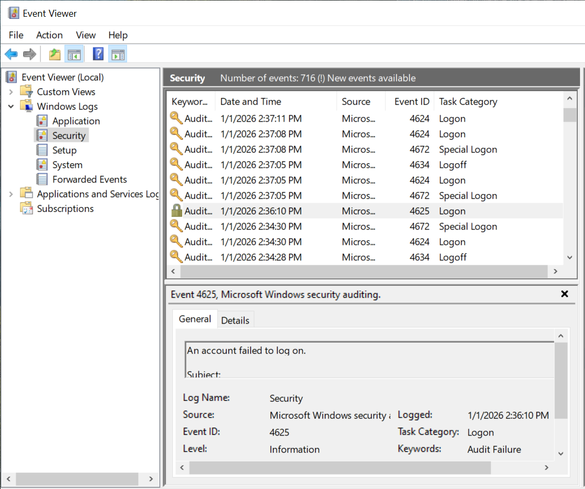

- **Real attacks:** Bots scan internet, probe RDP; expect hundreds quickly.  
- **Why query here first:** Demonstrates raw logs before forwarding them for central analysis.  


## Centralizing Logs: Log Analytics Workspace

**Log Analytics Workspace** is the central repository for querying logs.

- Search and create in Azure `Log Analytics Workspaces`, assigning to the same Resource Group/region. Choose a name (e.g., `law-soclab`); review/create.  
- **Connect to VM logs:** Forwards VM events here via agent (done later). 
- **Analogy:** Giant spreadsheet of all security events from VM.  


## Deploying Microsoft Sentinel

**Microsoft Sentinel** (**SIEM**—Security Information and Event Management) analyzes logs for threats.  

- Link to Log Analytics Workspace: Search Sentinel > Create > Select workspace > Add (31-day free trial, then per-log costs).  
- Access via portal > Sentinel instance.  
- **Significance:** Queries workspace logs, enriches with watchlists, visualizes attacks.  
- **Cost note:** Charges post-trial based on log volume—optimize/delete resources.  


## Forwarding Logs: Azure Monitor Agent (AMA) and Data Collection Rule

Connects VM to workspace/Sentinel.  

- In Sentinel > Content Hub > Windows Security Events > Install > Manage (after installing).

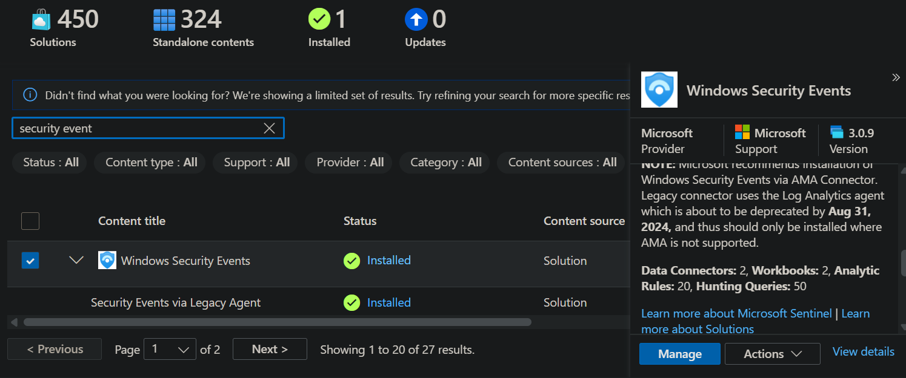
- Select "via Azure Monitor Agent" > Open connector > Create **Data Collection Rule (DCR)** (e.g., `dcr-windows`): Target Resource Group/VM, collect all events.
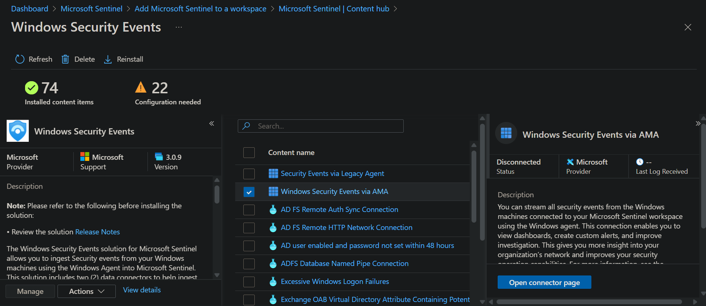
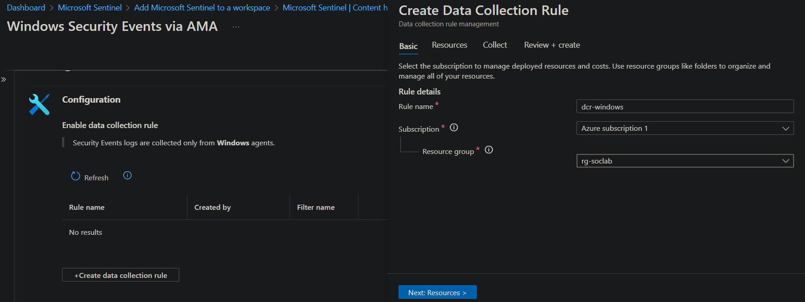
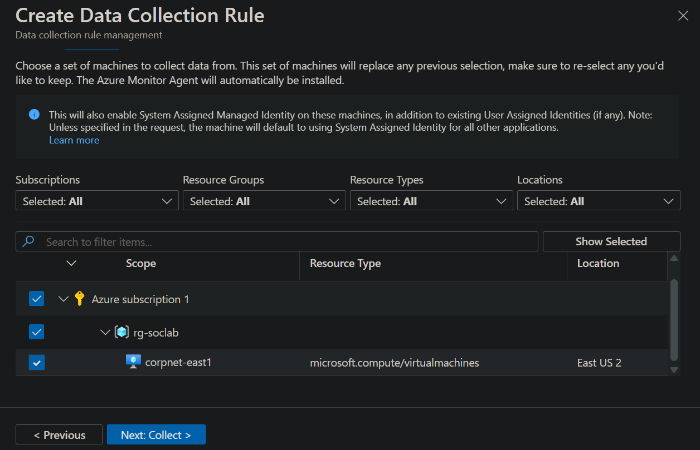
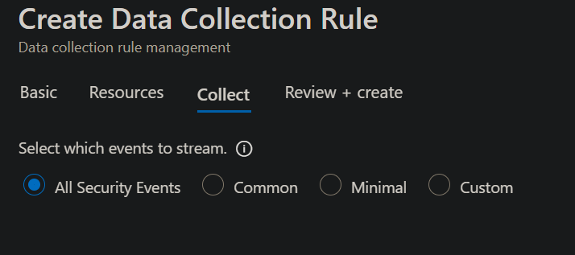
- Agent auto-installs on VM (Extensions > Azure Monitor Agent > Provisioning succeeded).  
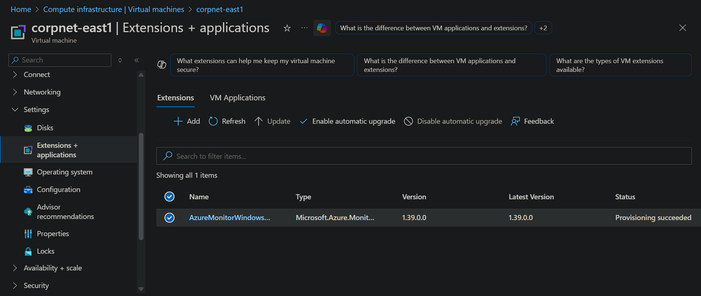
- **Mechanism:** Agent forwards SecurityEvent table to workspace; Sentinel accesses it.  
- Wait for logs: `SecurityEvent` query shows data after ~30min.  
- **Connection:** Enables central SIEM from local Event Viewer logs.  


## Mastering KQL Queries in Log Analytics

Going back to Log Analytics Workstapces > Logs > KQL mode:
<!-- 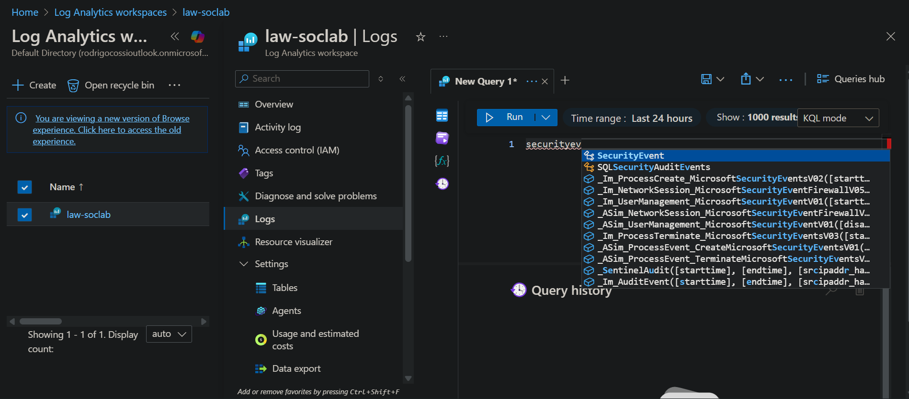 -->
**KQL** (**Kusto Query Language**) filters/analyzes log "tables" (spreadsheets).
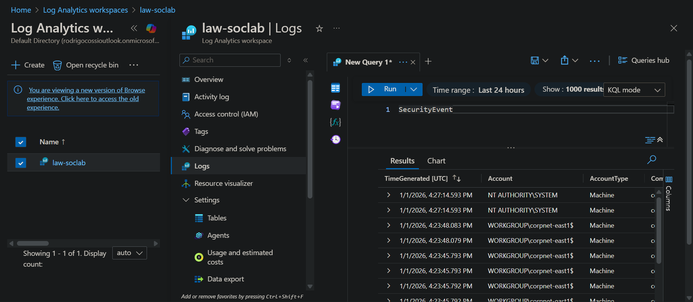

- Basics: `SecurityEvent` dumps all; `| where Account = "admin"` filters; `| project TimeGenerated, Account, Computer, EventID, IpAddress` selects columns.  
- Examples:
  - Failed logons: `SecurityEvent | where EventID == 4625`.  
  - Recent: `| where TimeGenerated > ago(5m)`.  
  - Project attacker details: Rename `IpAddress` to `AttackerIP`.  
- **Analogy:** SQL-like for spreadsheets—pipe (`|`) chains operations.  
- **IP geolocation prep:** Logs have IP but no location—needs watchlist.  
- **Resources:** kc7cyber.com (free).  
- **Why essential:** Transforms raw logs into insights (e.g., Israeli attacker).  

```kql
SecurityEvent
| where EventID == 4625
| project TimeGenerated, Computer, AttackerIP=IpAddress, Account, EventID
| where TimeGenerated > ago(1m)
```
   

## Enriching Data: GeoIP Watchlist

**Watchlist** maps IPs to locations (latitude/longitude/city/country).  

- Locate the file geoip-summarized.csv (in this repo), upload in Sentinel > Configuration > Watchlists > Microsoft Defender Portal > New (name/alias `geoip`, search key `network`).

- Upload takes time (~55k items); click on `View in logs` to access the Advanced Hunting page and query `_GetWatchlist('geoip')` verifies (columns: Network, Lat/Long, City, Country).
- **Join query example:** `let GeoIPDB_FULL =_GetWatchlist('geoip'); let WindowsEvents = SecurityEvent | where EventID == 4625 | order by TimeGenerated desc | evaluate ipv4_lookup(GeoIPDB_FULL, IpAddress, network); WindowsEvents | project TimeGenerated, Computer, AttackerIp = IpAddress, cityname, countryname, latitude, longitude` enriches with geolocation.

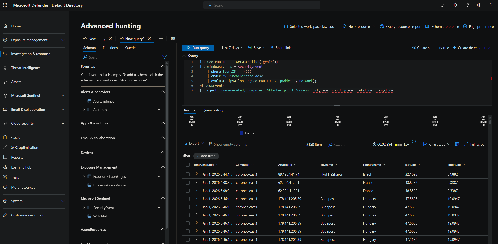

<!-- let GeoIPDB_FULL = _GetWatchlist("geoip");
let WindowsEvents = SecurityEvent;
WindowsEvents
| where EventID == 4625
| order by TimeGenerated desc
| evaluate ipv4_lookup(GeoIPDB_FULL, IpAddress, network)
| extend cityname = iff(isempty(cityname) or cityname == "-", "Unknown City", cityname)
| extend countryname = iff(isempty(countryname) or countryname == "-", "Unknown Country", countryname)
| summarize FailureCount = count() by IpAddress, latitude, longitude, cityname, countryname
| extend friendly_location = strcat(cityname, " (", countryname, ")") -->


- **Mechanism:** IP falls in block → lookup row → plot location.  
- **Analogy:** Spreadsheet lookup table for IP-to-map conversion.  


## Visualizing Global Attacks: Sentinel Workbook Map

Creates interactive attack map.  

- Microsoft Defender > Workbooks > Add > Edit > Advanced editor > replace JSON item 3 with obj from map.json.  
- Save as "RDP Attack Attempts"; edit map settings (lat/long, count failures per location).  
- Counts same-IP/geo as "entity".  
- Customize: Color palette, labels (e.g., `FriendlyLocation = strcat(CityName, " ", CountryName)`).  
- **Dynamic:** Updates over time—leave 24h for full view.  
- **Significance:** Visualizes real attacks.  

| Query Element | Function |
|---------------|----------|
| **Count by geo** | Aggregates failures per IP/location    |
| **Map plot** | Lat/long bubbles sized by attempts    |
| **Enrichment** | Watchlist join adds city/country    |

   

## Complete Lab Architecture and Maintenance

- **Full stack:** Tenant > Subscription > RG > VNet/Subnet > VM (open NSG/Windows firewall) → Azure Monitor Agent → Log Analytics → Sentinel (watchlist/workbook).  
- Logs flow: VM SecurityEvent → Workspace → KQL enrich → Map.  
- **Next:** Add analytic rules/incidents. Add monitoring for other forms of intrusion (ssh, smb, telnet, etc)
- **Maintenance:** Deprovision VM/NSG/delete RG; monitor costs.  
- **Real-world value:** Demonstrates SOC basics—logs, SIEM, visualization.  

> **💡 Key Insight:** Exposes how quickly internet scans hit exposed RDP (hundreds/minute).
